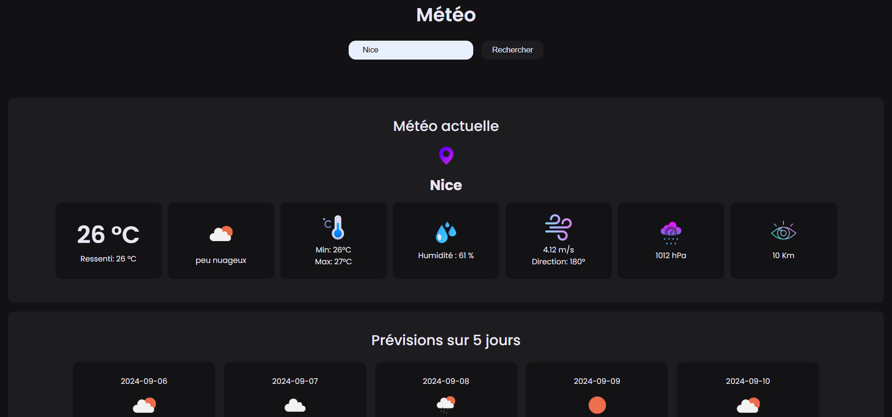

# Weather App

Welcome to the Weather App repository! This application allows you to view current and future weather forecasts for a given city.

## Features

- Display current weather conditions (temperature, feels like, humidity, wind speed, etc.).
- Weather forecasts for the next few days.
- Error handling and display of error messages.

## Screenshots



## Installation

To install and run the application locally, follow these steps:

1. Clone the repository:
   ```bash
   git clone https://github.com/your-username/weather-app.git
